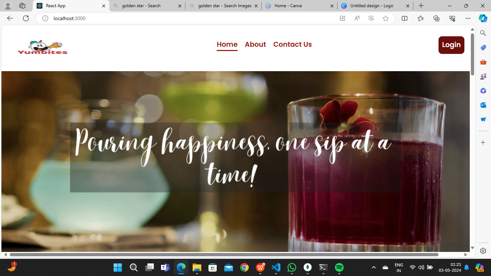
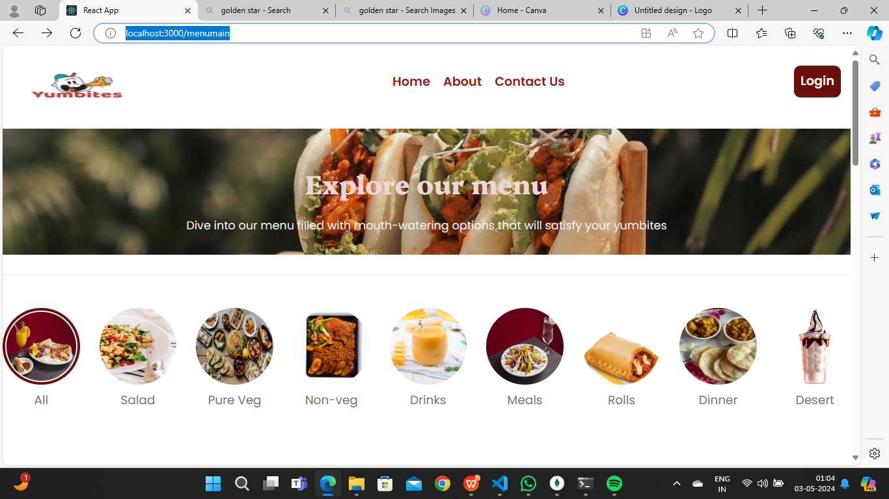
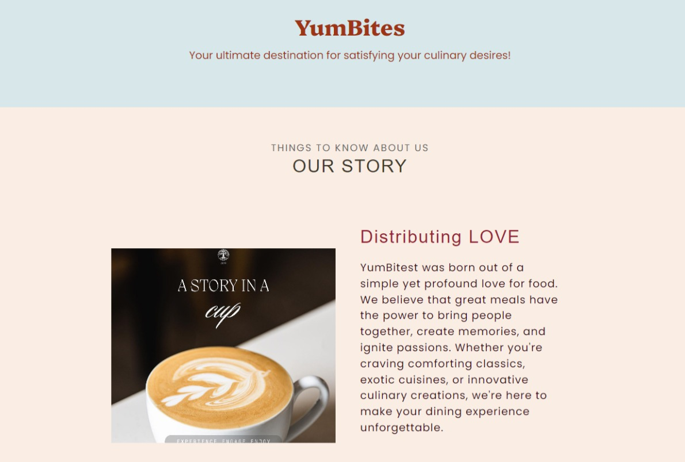

# 🍔 YumBites – React-Based Food Ordering Website
## 📌 Project Overview
YumBites is a React-based online food ordering website developed using the MERN stack (MongoDB, Express.js, React.js, Node.js).It allows customers to order food online, providers to manage food items, and admins to control the system.  
The project is designed to provide a simple and efficient platform for online food ordering and management.

# 🛠️ Technologies Used (MERN Stack)
## Frontend
 * React.js
 * HTML
 * CSS
 * Bootstrap
 * JavaScript
   
## Backend
 * Node.js
 * Express.js

## Database
* MongoDB

## Tools
* Visual Studio Code

# ⚙️ Main Features
## 👤 Customer
 * User registration and login
 * View food menu and categories
 * Add items to cart
 * Place food orders

## 🧑‍🍳 Provider
 * Add, update, and delete food items
 * Manage food products

## 🛡️ Admin
 * Manage customers and providers
 * Monitor system activities

# 🔄 System Workflow
 1. User registers and logs in.
 2. Customer selects food items and places an order.
 3. Provider manages food items and orders.
 4. Admin oversees the system.

# 🗄️ Backend & Database Features
 * RESTful APIs using Express.js
 * User authentication system
 * CRUD operations using MongoDB
 * Image upload using Multer
 * API testing with Postman

# ▶️ How to Run the Project (Local Setup)
1. Open Project Folder  
    cd foodordering
2. Install Backend Dependencies  
    npm install
3. Start Backend Server (Node.js)  
    node server.js
4. Start Frontend (React App)  
    npm start
5. After running the project, open in Browser  
    localhost:\<port-number\>

# 🍹 Live Project Demo

